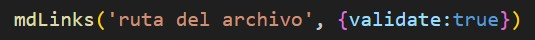
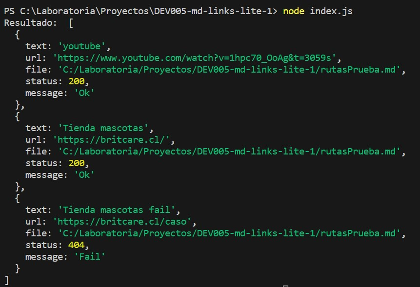
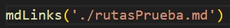
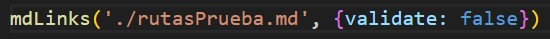
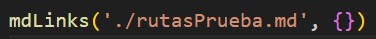
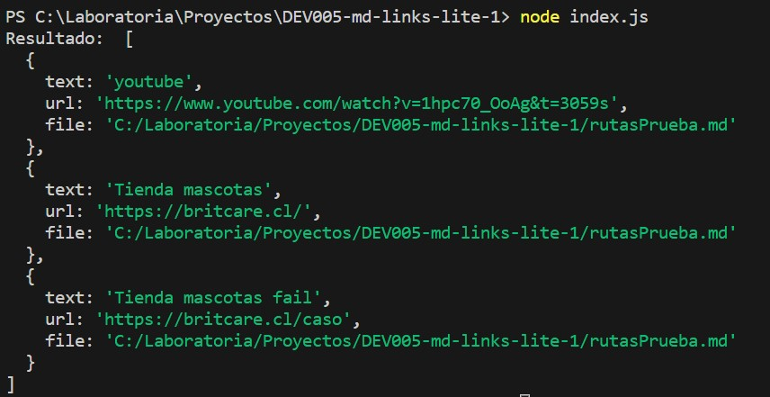
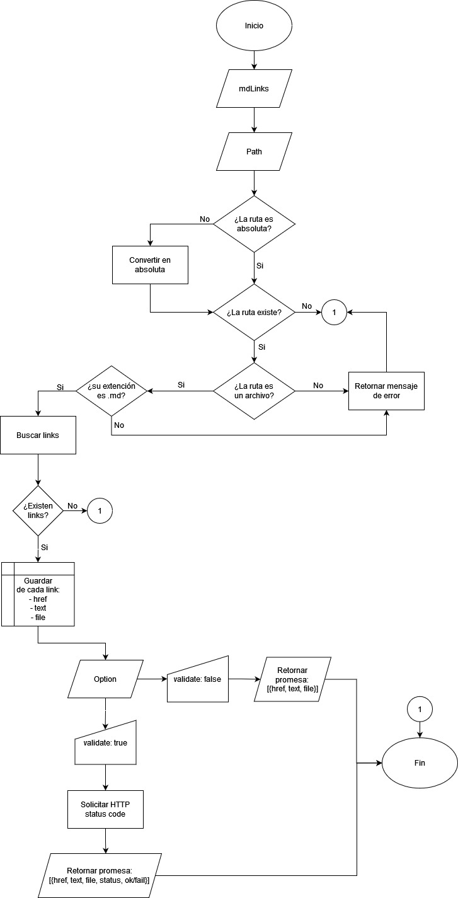

# Markdown Links

## Índice

* [1. Descripción](#1-descripción)
* [2. Instrucciones de uso](#2-instrucciones-de-uso)
* [3. Documentación](#3-documentacion)
* [4. Ejemplos](#4-ejemplos)

***

## 1. Descripción

### Markdown Links Lite

La librería Markdown Links Lite es una herramienta poderosa y sencilla que permite extraer enlaces de archivos Markdown y obtener información detallada de cada uno. Al utilizar esta librería, se puede obtener un arreglo de objetos que contienen el texto, la URL y la ubicación del archivo donde se encontró. Además, al incorporar la opción validate, se podrá obtener información sobre el estado de cada enlace junto con un mensaje que indica el funcionamiento o falla.

Con Markdown Links Lite, ya no se tendrá que buscar manualmente los enlaces en archivos Markdown ya que se logra automatizar el proceso de extracción de enlaces y obtener información valiosa sobre cada uno de ellos.

## 2. Instrucciones de uso

1. Utiliza la función mdLinks para ingresar la ruta del archivo del que se desea extraer links y solicita la verificación de ellos a través del objeto validate: true.

2. Luego, en el terminal, ingresa el texto **node index.js** y la función devolverá una promesa que se resuelve en un arreglo de objetos con la siguiente información:

* Si se desea obtener solo el texto, url y ubicación de los links, existen tres opciones:

### 1. Ingresar solo la ruta:

### 2. Ingresar la Ruta y validate: false:

### 3. Ingresar la ruta del archivo y dejar el objeto vacío:

Todas estas opciones permiten obtener el mismo resultado:

## 3. Funcionamiento de la librería

Diagrama de flujo:

